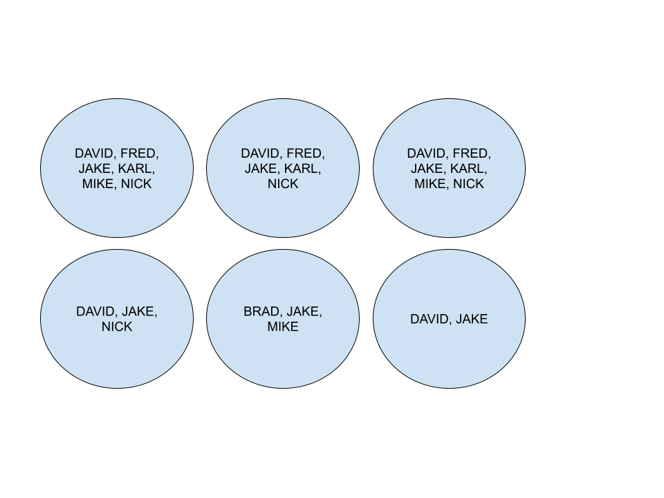
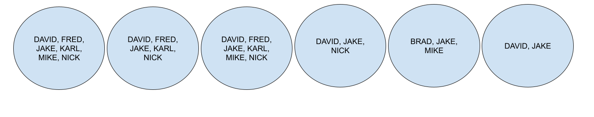

# CS440 - Homework Two

Arun Felix

Professor Wang 

## Problem 1 - Constrain Satisfaction Problem.

let's break the team members, and make lists for them:

- Brad (B) can only work on Part 5, and will not work together with Nick (N).
- David (D) cannot work on Part 5, and will not work together with Jake (J). Moreover, David must work on a part before Fred (F)’s.
- Fred (F) has time constraints, and cannot work on the last three parts (i.e., Part 4, 5, or 6).
- Jake (J) can only work on a part that is after Nick’s (N).
- Karl (K) has limited skill set and can only work on Part 1, Part 2 or Part 3. Moreover, Karl (K) must work on a part that is before David’s (D).
- Mike (M) is odd, and can only contribute to odd-numbered parts (1, 3, or 5).
- Nick (N) cannot work on Part 6, and must work on a part that is before Mike’s (M).

### Part a - unary constraint 

We can make sets for each person:

$B = {1,2,3,4,5,6}$

$D = {1,2,3,4,5,6}$

$F = {1,2,3,4,5,6}$

$J = {1,2,3,4,5,6}$

$K = {1,2,3,4,5,6}$

$M = {1,2,3,4,5,6}$

$N = {1,2,3,4,5,6}$

Let's start off with Brad, he can only work on part 5, so we can remove the other domains for Brad except for 5. x

$B = {5}$

David Cannot work on part 5, and cannot work with Jake: We can immediately remove 5 from David's domain. x

$D = {1,2,3,4,6}$

Let's look at fred: He cannot work on parts 4, 5 and 6. We can remove this from the domain.

$F = {1,2,3}$

Jake can only work after nick. We never assigned anything for nick, so we can't eliminate anything from his domain. Jake cannot work on part one, since he can only work after nick:

$J = {2,3,4,5,6}$

Karl can only work on part 1,2,3, and must work before david. We can simplify his domain: x

$K = {1,2,3}$

Mike can only work on odd numbered parts: 

$M = {1,3,5}$

Nick can't work on part 6. Since he doesn't like mike, he cannot do part 5. also, he needs to work on a part before mike, giving us: x

$N = {1,2,3,4}$

 

### part b - Minimum Remaining Value

- Here, we'll assign the variables with the smallest domains first. This will let us backtrack quicker, and not pursue pointless routes. For this, we can pick Brad first, since he only has one domain, or least remaining value.

### part c - LCV and Forward Checking: 

- LCV will pick values that will cause the least conflicts. 
- For this, we should always pick the variables with the largest domains first, so we have more options regarding what to pick.
- Below is a visual of our parts. 

- Let's first pick a variable for part 1. 

