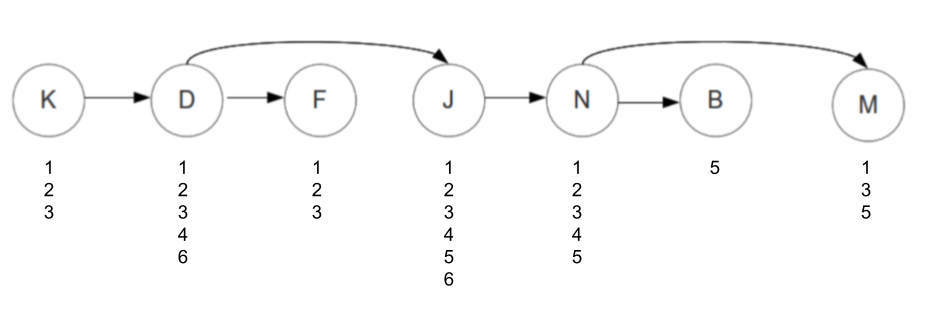
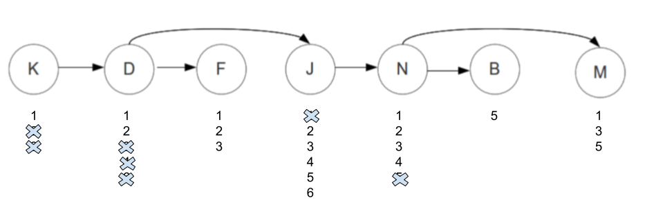
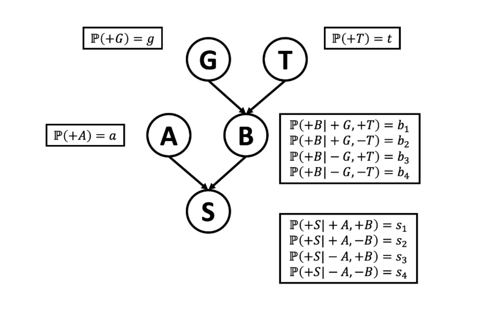
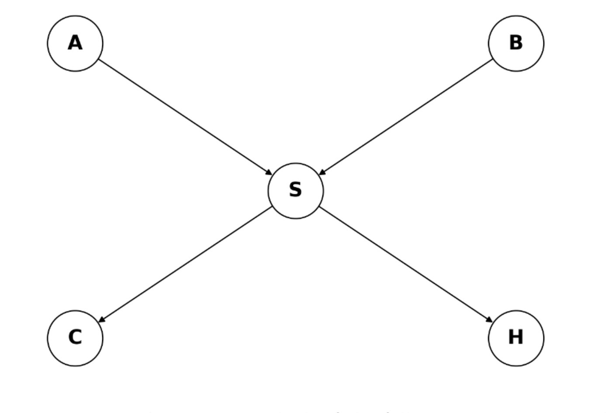
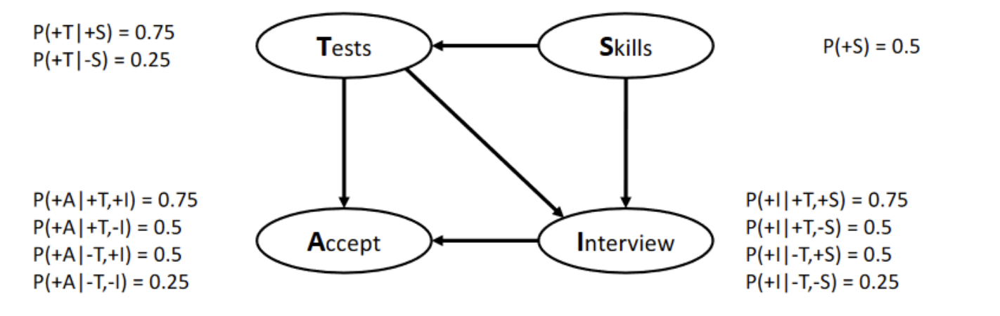

---
header-includes:
  - \usepackage{cancel}
---

# CS440 - Homework Two

Arun Felix

## Note: I'd like to apply 1 late day to this assignment, cheers!


## Problem 1 - Constrain Satisfaction Problem

A team of seven engineers is trying to collaborate on a large joint project. They have decided to split the project into six parts. A part could end up having more than one team member or potentially no one to work on it. The team of engineers would like the following constraints to be satisfied:

- Brad (B) can only work on Part 5, and will not work together with Nick (N).
- David (D) cannot work on Part 5, and will not work together with Jake (J). Moreover, David must work on a part before Fred (F)’s.
- Fred (F) has time constraints, and cannot work on the last three parts (i.e., Part 4, 5, or 6).
- Jake (J) can only work on a part that is after Nick’s (N).
- Karl (K) has limited skill set and can only work on Part 1, Part 2 or Part 3. Moreover, Karl (K) must work on a part that is before David’s (D).
- Mike (M) is odd, and can only contribute to odd-numbered parts (1, 3, or 5).
- Nick (N) cannot work on Part 6, and must work on a part that is before Mike’s (M).


### Part a

(a) (7pts) Unary constraints. We model this problem as a constraint satisfaction problem (CSP). The variables correspond to each team member, Brad, David, Fred, Jake, Karl, Mike, and Nick. The domains are the Parts 1, 2, 3, 4, 5, and 6. Let us first focus on constraints that involve only one variable. After applying the unary constraints, what are the resulting domains of each variable?

- Let's define the domain for each person based on what we have above. 

We know that Brad can only work on part 5, so his domain is $\{5\}$

Next, We Know that David cannot work on part 5, so his domain is $\{1,2,3,4,6\}$

Fred cannot work on parts 4, 5 and 6, so his domain becomes $\{1,2,3\}$

Jake has no unary constraints, so his domain is  $\{1,2,3,4,5,6\}$

Karl can only work on part 1, 2 and 3, so his domain is $\{1,2,3\}$

Mike can only work on odd numbered parts, so his domain is $\{1,3,5\}$

Nick cannot work on 6, so his domain is $\{1,2,3,4,5\}$


### part b

(1pt) MRV. If we apply the Minimum Remaining Value (MRV) heuristic, which variable should be assigned first?

- If we want to use MRV, we'd want to assign a value to the variable with the minimum domain. In this context, we'd choose Brad, since the size of his domain is one. 

### part c: 

(c) (5pts) LCV and Forward Checking. Instead of MRV, let us assume that we proceed with assigning Mike (M) first. For value ordering, we use the Least Constraining Value (LCV) heuristic. We use Forward Checking to compute the number of remaining values in other variables (other engineers’) domains. What ordering of values would be prescribed by the LCV heuristic? Please show your work, i.e., include the resulting filtered domains that will be different for the different value assignment to Mike.

Here, we want to use LCV, where we choose the value with the lowest constaint. this means that we cross off the fewest, We want to use Forward checking, which will compute the remaining domain for the engineers affected by the decision. We want to test the order of values, assuming that we assign the value to Mike first. 

- Let's look at what assigning mike does:


- Let's say we assign mike to 1:
  - nick needs to be assigned a part before mike, so we'd remove all the values in the domain, giving us $\{\emptyset\}$
  - All the other domains will not change.
  - Since we have an empty set, we need to backtrack. 
- Let's now try to assign mike to 3:
  - similar to previously, nick needs to work before mike, we change it's domain to $\{ 1,2 \}$
- If we assign mike to 5, we won't need to change nick, hence the least constrained variable.

### part d:

(d) Tree-structured CSP. Note this is a tree-structured CSP, so we decide not to run backtrack-
ing search and instead use the efficient two-pass algorithm to solve tree-structured CSPs. We
will run this two-pass algorithm after applying the unary constraints from Part (a). Below is the tree-structured CSP graph for you to proceed working on.



(7pts) First Pass: Backward Removal. Pass from right to left to perform domain pruning. Write the values that remain in each domain for each variable.

- First, we need to do a pass from right to left, and prune the children before parents, Let's start with the $N \rightarrow M$. Since Nick needs to work before mike, we can also say mike needs to work after nick. 


| Nick | Mike | 
| ---- | ---- |
|  1   | $\{3,5\}$ |
|  2   |  $\{3,5\}$ |
|  3   | $\{5\}$|
|  4   | $\{5\}$|
|  5   | $\{\emptyset\}$|

Here, if we assign nick to 5, mike will have an empty domain. Because of this, we need to prune 5 from nick. 


- Next, let's look from $N \rightarrow B$

| Nick | Brad |
| -------------- | --------------- |
| 1 | $\{5\}$ |
| 2 | $\{5\}$ |
| 3 | $\{5\}$ |
| 4 | $\{5\}$ |

We don't need to prune this, since we already pruned 5. 


- Now, we can work on $J \rightarrow N$
- Jake can only work after nick. In other words, Nick ({1,2,3,4}) must work before Jake. 

| Jake  | Nick  |
| ----- | ----- |
|   1   |   $\{\emptyset\}$    |
|   2   |   {1}    |
|   3   |    {1,2}   |
|   4   |   {1,2,3}    |
|   5   |    {1,2,3,4}   |
|   6   |   {1,2,3,4}    |

- Because nick has an empty domain from jake, we can prune one. 


- Next, we can look at Daniel  $\rightarrow$  Fred. David can only work before Fred, or Fred needs to work after david. 

| Daniel | Fred |
| ----- | ----- |
|   1   | {2,3}|
|   2   | {3}| 
|   3   | {$\emptyset$} |
|   4   | {$\emptyset$} | 
|   6   | {$\emptyset$}  |

Next, we can look at $Daniel \rightarrow Jake$. Jacob cannot work with jacob. 

| Daniel | Jake |
| ----- | ----- |
|   1   | {2,3,4,5,6}  |
|   2   | {3,4,5,6} |

We don't need to do any pruning here. Next, we can look at Karl $\rightarrow$ Daniel. Karl, must work before david, so david needs to work after karl. 

| Karl | Daniel |
| ---- | ------ |
|  1   |   {2}  |
|  2   |   {$\emptyset$} |
|  3   |   {$\emptyset$} |

Since assigning karl to 2 or 3 leads to an empty domain for daniel, we prune 2 and 3. 

below is the final tree after pruning from right to left. 



(7pts) Second Pass: Forward Assignment. Pass from left to right, assigning values to variables. If there is more than one possible assignment, choose the highest number project. What would be the final assignment?

Let's iterate from left to right:

- For Karl, we assign him to the only part available, 1. 
- We assign david to part 2. 
- We assign Fred to part 3. 
- We assign Jake to part 6.
- We assign Nick to part 4. 
- We assign Brad to part 5. 
- We assign Mike to part 5. 

Fortunately, we didn't have backtrack, so our assignments are consistent with the constaints. 

\newpage

## Problem 2 - Bayesian Network

Suppose that a patient can have a symptom (S) that can be caused by two different diseases (A and B). It is known that the variation of gene G and gene T play a role in the manifestation of disease B. The Bayesian Network and corresponding conditional probability tables (CPTs) for this situation are shown below. You can assume that all variables are binary Please express the following probabilities as functions of $g, t, a, b1, . . . , b4, s1, . . . , s4$.



(a) (4pts) Based on the Bayesian network and CPTs, calculate the probability $P (+G, +T, -A, -B, -S).$

We can use our bayesian network to calculate this:

$P(+G,+T,-A,-B,-S) = P(-S|-A,-B) \times P(-A) \times P(-B|+G,+T)\times P(+G)\times P(+T)$

$P(-S|-A,-B) = 1 - P(+S|-A,-B) = 1 - S_4$

$P(-A) = 1 - a$

$P(-B|+G,+T) = 1 - P(+B|+G,+T) = 1 - b_1$

$P(+G) = g$

$P(+T) = t$

$P(+G,+T,-A,-B,-S) = (1 - S_4) \times (1-a) \times (1 - b_1) \times g \times t$


(b) (6pts) Based on the Bayesian network and CPTs, calculate the probability $P (+A, -B)$.


We know that A and B are independent of eachother, so:

$P(+A, -B) = P(+A) \times P(-B)$

$P(+A) = a$

$P(-B) = P(-B|+G, +T) \times P(-B| +G, -T) \times P(-B|-G, +T) \times P(-B| -G, -T)$

$P(-B) = (1 - P(+B|+G, +T)) \times (1 - P(+B|+G, -T)) \times (1 - P(+B|-G, +T)) \times (1 - P(+B|-G, -T))$

$P(-B) = (1 - b_1) \times (1 - b_2) \times (1 - b_3) \times (1 - b_4)$

\newpage


## Problem 3 

As in Problem 1, the symptom (S) can be caused by two different diseases (A and B). Let us assume that the symptom (S) may lead to hospitalization (H) and missing class (C). See the new Bayesian network representation below.



Based on the Bayesian network structure, which of the following are guaranteed to be True, and which are guaranteed to be False? Briefly explain why:

a) C and B are not independent from eachother, since there exists an undirected path between c and b. 

b) H and B are conditionally independent from eachother given S, since S would block the path between H and B. 

c) A and B are independent from each each, as this follows the case 

```
a   b 
 \ /
  c
```
Here, a and b will be independent from eachother. 

d) A and B aren't conditionally independent to eachother given S, since, from the example before, a and b aren't independent given c. 

e) A and B are conditionally independent given C,  since the path between A and B with S is already inactive.

f) c and h are not independent of each other, as it falls under this case

```
   a 
  /\
 b c
```

under this case, a and b are not independent of each other. 

g) here, c and h are not conditionally independent given B. It doesn't invalidate the path between C and H.  


\newpage

## Problem 4 

Consider the following university admission problem, shown in the figure below. Note that all the variables are binary. A decision on whether to accept a candidate depends on their standardized tests and interview performance, which serve as indicators of their skills. The Bayesian Network and corresponding conditional probability tables for this situation are also shown. Please compute the following probabilities using variable elimination.




(a) Write down the expresion for $P(T,A,S,I)$ using the chain rule. 

$P(T,A,S,I) = P(T|A,S,I) \times \cancel{P(A,S,I)} P(A|S,I) \times \cancel{P(S,I)} P(S|I)\times P(I)$

(b) (10pts) Use variable elimination to compute P (+T, +A) (Hint: marginalize over S and I ).

To figure out $P(+T,+A)$, we need to perform a summation over S and I. 

$P(+T,+A) = \sum_S \sum_I P(+T,+A,S,I)$

$P(T,A,S,I) = P(A|T,I) \times P(T|S) \times P(I|T,S) \times P(S)$

For I = 0, S = 0:

$P(+A | +T, -I) \times P(+T|-S) \times P(-I|+T,-S) \times P(-S)$

$= 0.5 \times 0.25 \times 0.5 \times 0.5 = 0.03125$

For I = 0, S = 1:

$P(+A | +T, -I) \times P(+T|+S) \times P(-I|+T,+S) \times P(+S)$

$0.5 \times 0.75 \times 0.25 \times 0.5 = 0.046875$

For I = 1, S = 0:

$P(+A | +T, +I) \times P(+T|-S) \times P(+I|+T,-S) \times P(-S)$

$= 0.75 \times 0.25 \times 0.5 \times 0.5 = 0.046875$

For I = 1, S = 1:

$P(+A | +T, +I) \times P(+T|+S) \times P(+I|+T,+S) \times P(+S)$

$= 0.75 \times 0.75 \times 0.75 \times 0.5 = 0.2109375$

now, we can add all these together:

$0.03125 + 0.046875 + 0.046875 + 0.2109375 = 0.3359375$

Therefore, P(+T,+A) = 0.3359375


(c) (4pts) Use variable elimination to further compute P (-T, +A).

We can perform the same steps as before, except change -T and +A. 

$P(-T,+A) = \sum_S \sum_I P(-T,+A,S,I)$


$P(-T,+A,S,I) = P(+A|-T,I) \times P(-T|S) \times P(I|-T,S) \times P(S)$

for i  = 0, s = 0:

$P(+A|-T,-I) \times P(-T|-S) \times P(-I|-T,-S) \times P(-S)$

$0.25 \times 0.75 \times 0.75 \times 0.5 = 0.0703125$

for i = 0, s = 1:

$P(+A|-T,-I) \times P(-T|+S) \times P(-I|-T,+S) \times P(+S)$

$0.25 \times 0.25 \times 0.5 \times 0.5 = 0.015625$

for i = 1, s = 0:

$P(+A|-T,+I) \times P(-T|-S) \times P(+I|-T,-S) \times P(-S)$

$0.5 \times 0.75 \times 0.25 \times 0.5 = 0.046865$

for i = 1, s = 1:

$P(+A|-T,+I) \times P(-T|+S) \times P(+I|-T,+S) \times P(+S)$

$0.5 \times 0.25 \times 0.5 \times 0.5 = 0.03125$


We can add all these up:

$P(-T,+A) = 0.0703125 + 0.015625 + 0.046865 + 0.03125 = 0.1640525$


(d) (2pts) Use answers from the previous two parts to calculate P (+T | +A).

We know that $P(+T|+A) = \frac{P(+T,+A)}{P(+A)}$

We know A only depends on T, so we can add the two probabilities we calculated:

$P(+A) = P(-T,+A) + P(+T,+A) = 0.1640525 + 0.3359375 = 0.49999$

finally, we can perform the division:

$P(+T|+A) = \frac{0.3359375}{0.49999} \approx 0.6718884377$
